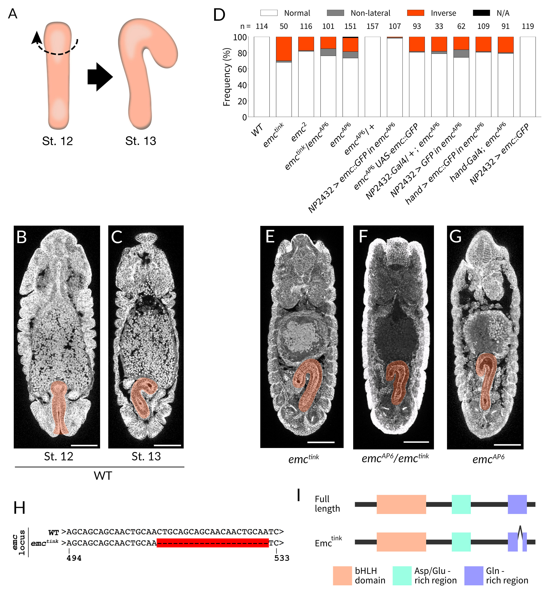
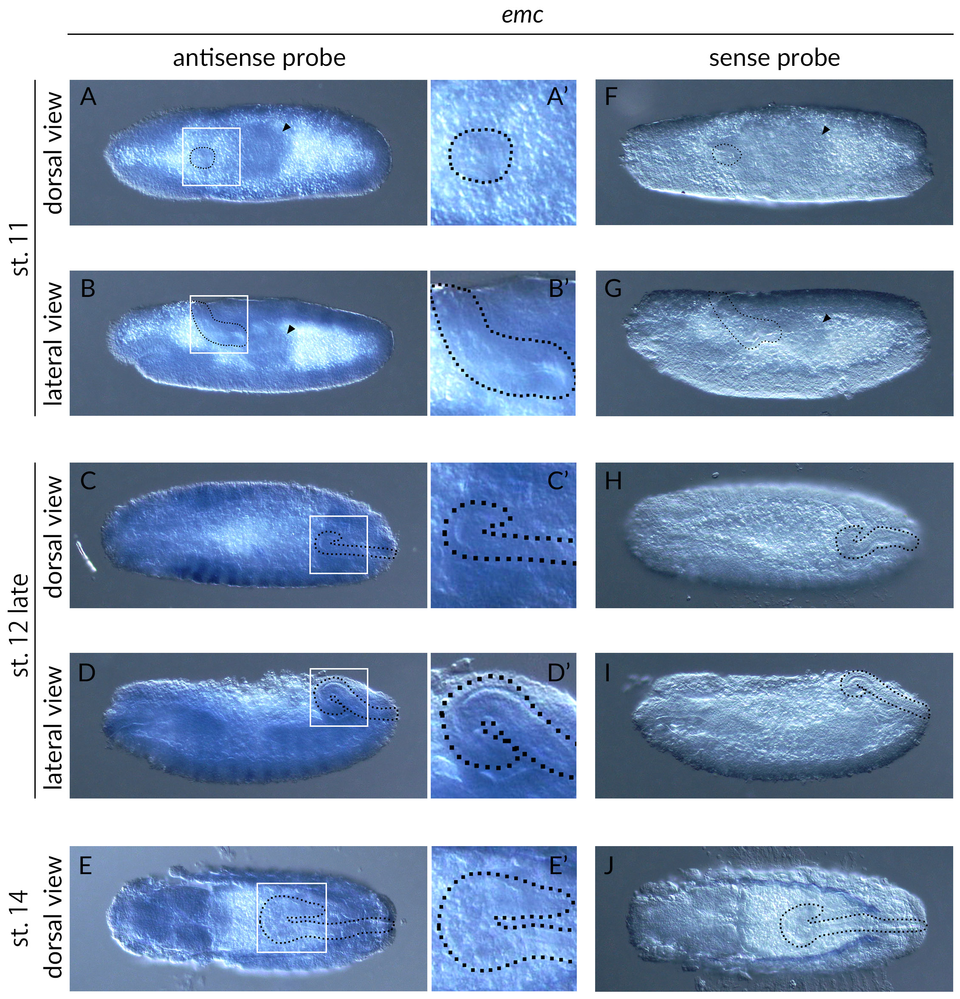

## Figures and Tables

### Figure 1

  
**Fig. 1.** ***emc*** **mutant embryos show defects in LR asymmetric development of the embryonic hindgut.**  
(A)
Schematic showing the LR asymmetric development of the *Drosophila* embryonic hindgut as viewed from the dorsal side.
The hindgut has an LR symmetric shape bending dorsally (left) at stage 12, and then undergoes a counterclockwise (broken arrow) rotation from late stage 12, consequently bending to the right at stage 13 (right).
(B-C)
The hindgut (orange) of wild-type embryos at stage 12 (B) and stage 13 (C).
(D-I)
Lorem ipsum dolor sit amet, consectetur adipiscing elit, sed do eiusmod tempor incididunt ut labore et dolore magna aliqua.
Ut enim ad minim veniam, quis nostrud exercitation ullamco laboris nisi ut aliquip ex ea commodo consequat.
Duis aute irure dolor in reprehenderit in voluptate velit esse cillum dolore eu fugiat nulla pariatur.
Excepteur sint occaecat cupidatat non proident, sunt in culpa qui officia deserunt mollit anim id est laborum.

### Figure 2

  
**Fig. 2. Figure Title.**  
(A)
Lorem ipsum dolor sit amet, consectetur adipiscing elit, sed do eiusmod tempor incididunt ut labore et dolore magna aliqua.
Ut enim ad minim veniam, quis nostrud exercitation ullamco laboris nisi ut aliquip ex ea commodo consequat.
Duis aute irure dolor in reprehenderit in voluptate velit esse cillum dolore eu fugiat nulla pariatur.
Excepteur sint occaecat cupidatat non proident, sunt in culpa qui officia deserunt mollit anim id est laborum.
(B)
Lorem ipsum dolor sit amet, consectetur adipiscing elit, sed do eiusmod tempor incididunt ut labore et dolore magna aliqua.
Ut enim ad minim veniam, quis nostrud exercitation ullamco laboris nisi ut aliquip ex ea commodo consequat.
Duis aute irure dolor in reprehenderit in voluptate velit esse cillum dolore eu fugiat nulla pariatur.
Excepteur sint occaecat cupidatat non proident, sunt in culpa qui officia deserunt mollit anim id est laborum.

### Table S1

| *emc* expression in the hindgut | stage 11   | stage 12   | stage 14   |
| ------------------------------: | :--------- | :--------- | :--------- |
| +                               | 11         | 4          | 0          |
| +/-                             | 1          | 13         | 7          |
| -                               | 0          | 0          | 14         |
| **TOTAL**                       | **12**     | **17**     | **21**     |

**Table S1**
The expression of *emc* was detected by *in situ* hybridization using an antisense probe for *emc* (see Figure 2).
The numbers of embryos showing *emc* signals in the hindgut primordium and hindgut are shown.
+, strong signal;
+/-, weak signal;
-, no signal.

